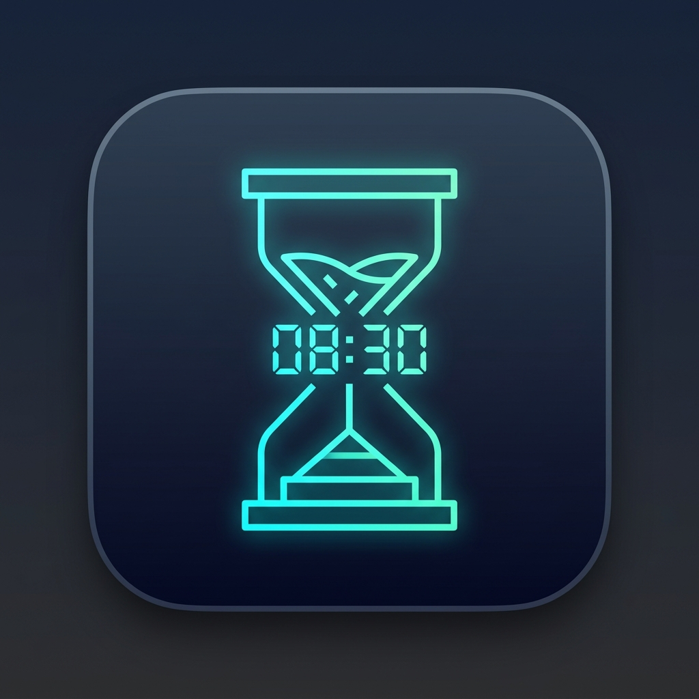
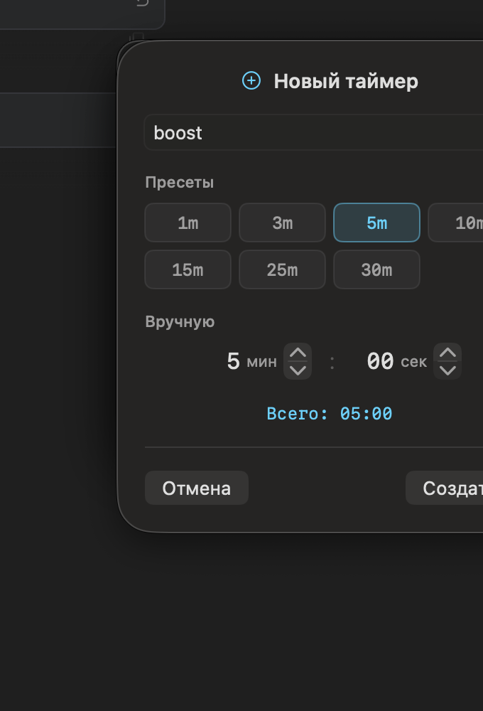

<p align="center">
  
</p>

<h1 align="center">⚡ Boost Timer</h1>

<p align="center">
  <strong>Минималистичный плавающий таймер обратного отсчёта для macOS</strong><br>
  Поверх окон • Полупрозрачный • Несколько таймеров • Нативный SwiftUI
</p>

<p align="center">
  
  
  
</p>

---

🇬🇧 [English documentation](README.md)

## Возможности

- **Поверх всех окон** — плавающее окно всегда видно поверх остальных приложений
- **Полупрозрачность** — эффект glassmorphism, органично вписывается в рабочий стол
- **Несколько таймеров** — запускайте несколько таймеров одновременно в одном компактном окне
- **Перетаскивание** — расположите таймер в любом удобном месте экрана
- **Пресеты** — быстрый выбор: 1, 3, 5, 10, 15, 25, 30 минут
- **Ручной ввод** — точная установка минут и секунд
- **Именование** — дайте каждому таймеру имя (например, «Созвон», «Перерыв»)
- **Предупреждение** — настраиваемый порог (по умолчанию 3 мин):
  - Мягкий звуковой сигнал (chime)
  - Оранжевая пульсация
  - Убирается прозрачность
- **Завершение** — когда таймер достигает 00:00:
  - Настойчивый звуковой сигнал
  - Красная пульсирующая анимация
  - Системное уведомление macOS
- **Тёмная / Светлая тема** — переключение с сохранением выбора
- **Настройка звуков** — выбор из 14 системных звуков macOS, предпрослушивание
- **Лёгкий** — нативный SwiftUI, ~5MB, минимальное потребление ресурсов

## Скриншоты

<p align="center">
  
</p>

## Требования

- macOS 14.0 (Sonoma) или новее
- Xcode 15.0+ (для сборки из исходников)
- [XcodeGen](https://github.com/yonaskolb/XcodeGen) (устанавливается автоматически через `make`)

## Установка

### Вариант 1: Сборка и запуск

```bash
# Клонируйте репозиторий
git clone https://github.com/awens84/timer.git
cd timer

# Соберите и запустите (XcodeGen установится автоматически)
make run
```

### Вариант 2: Сборка Release и установка

```bash
make build
make install  # Копирует в /Applications
```

### Вариант 3: Открыть в Xcode

```bash
make generate  # Создаёт BoostTimer.xcodeproj
open BoostTimer.xcodeproj
# Затем нажмите ⌘R для запуска
```

## Использование

1. **Запуск** — таймер появляется как плавающая панель в правом верхнем углу
2. **Добавить таймер** — нажмите «Новый таймер» или `⌘N`
3. **Установить время** — выберите пресет или введите вручную, при желании задайте имя
4. **Старт** — нажмите кнопку воспроизведения ▶
5. **Перетаскивание** — захватите панель в любом месте для перемещения
6. **Настройки** — нажмите ⚙ для настройки темы, звуков и порога предупреждения

### Горячие клавиши

| Сочетание | Действие |
|-----------|----------|
| `⌘N` | Новый таймер |
| `⌘W` | Закрыть (выход) |

## Структура проекта

```
BoostTimer/
├── App/
│   ├── BoostTimerApp.swift        # Точка входа
│   └── AppDelegate.swift          # Настройка FloatingPanel (NSPanel)
├── Models/
│   └── TimerItem.swift            # Модель таймера + машина состояний
├── ViewModels/
│   └── TimerListViewModel.swift   # Управление коллекцией таймеров
├── Views/
│   ├── MainView.swift             # Корневой вид со списком таймеров
│   ├── TimerRowView.swift         # Строка таймера + анимации
│   ├── AddTimerSheet.swift        # Диалог создания таймера
│   └── SettingsSheet.swift        # Диалог настроек
├── Services/
│   ├── SoundService.swift         # Воспроизведение системных звуков
│   └── NotificationService.swift  # Уведомления macOS
├── Utilities/
│   └── Theme.swift                # Определение цветов
└── Resources/
    ├── Info.plist
    └── Assets.xcassets/
```

## Технические детали

- **Окно**: `NSPanel` с `.nonactivatingPanel` — не перехватывает фокус у других приложений
- **Поверх окон**: уровень `.floating` + `hidesOnDeactivate = false`
- **Прозрачность**: `.ultraThinMaterial` фон SwiftUI
- **Точность**: `Timer` с тиком 100мс на `.common` RunLoop (работает при перетаскивании)
- **Звуки**: встроенные системные звуки macOS через `NSSound` — без бандлинга файлов
- **Настройки**: `@AppStorage` (UserDefaults) — сохраняются автоматически
- **Архитектура**: MVVM с `@Observable` (Observation framework)

## Лицензия

MIT — см. [LICENSE](LICENSE)

## Автор

[@awens84](https://github.com/awens84)
